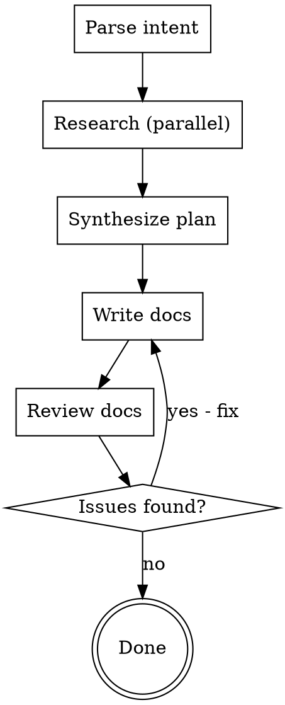

# Documentation Writer

Orchestrates research, writing, and review for React documentation.

## Invocation

```
/write add optimisticKey              → creates new reference docs
/write update ViewTransition Activity → updates ViewTransition docs to cover Activity
/write transition learn docs          → creates new learn docs for transitions
/write blog post for React 20         → creates a new blog post
```

## Workflow



### Step 1: Parse Intent

Determine from the user's instruction:

| Field | How to determine |
|-------|------------------|
| **Action** | "add"/"create"/"new" = new page; "update"/"edit"/"with" = modify existing |
| **Topic** | The React API or concept (e.g., `optimisticKey`, `ViewTransition`, `transitions`) |
| **Doc type** | "reference" (default for APIs/hooks/components), "learn" (for concepts/guides), "blog" (for announcements) |
| **Target file** | For updates: find existing file in `src/content/`. For new: determine path from doc type |

If the intent is ambiguous, ask the user to clarify before proceeding.

### Step 2: Research (Parallel Agents)

Spawn these agents **in parallel**:

#### Agent 1: React Expert Research

Use a Task agent (subagent_type: `general-purpose`) to invoke `/react-expert <topic>`. This researches the React source code, tests, PRs, issues, and type signatures.

**Prompt:**
```
Invoke the /react-expert skill for <TOPIC>. Follow the skill's full workflow:
setup the React repo, dispatch all 6 research agents in parallel, synthesize
results, and save to .claude/research/<topic>.md. Return the full research document.
```

#### Agent 2: Existing Docs Audit

Use a Task agent (subagent_type: `Explore`) to find and read existing documentation for the topic.

**Prompt:**
```
Find all existing documentation related to <TOPIC> in this repo:
1. Search src/content/ for files mentioning <TOPIC>
2. Read any matching files fully
3. For updates: identify what sections exist and what's missing
4. For new pages: identify related pages to understand linking/cross-references
5. Check src/sidebarLearn.json and src/sidebarReference.json for navigation placement

Return: list of existing files with summaries, navigation structure, and gaps.
```

#### Agent 3: Use Case Research

Use a Task agent (subagent_type: `general-purpose`) with web search to find common use cases and patterns.

**Prompt:**
```
Search the web for common use cases and patterns for React's <TOPIC>.
Focus on:
1. Real-world usage patterns developers actually need
2. Common mistakes or confusion points
3. Migration patterns (if replacing an older API)
4. Framework integration patterns (Next.js, Remix, etc.)

Return a summary of the top 5-8 use cases with brief code sketches.
Do NOT search Stack Overflow. Focus on official docs, GitHub discussions,
and high-quality technical blogs.
```

### Step 3: Synthesize Writing Plan

After all research agents complete, create a writing plan that includes:

1. **Page type** (from docs-writer-reference decision tree or learn/blog type)
2. **File path** for the new or updated file
3. **Outline** with section headings matching the appropriate template
4. **Content notes** for each section, drawn from research:
   - API signature and parameters (from react-expert types)
   - Usage examples (from react-expert tests + use case research)
   - Caveats and pitfalls (from react-expert warnings/errors/issues)
   - Cross-references to related pages (from docs audit)
5. **Navigation changes** needed (sidebar JSON updates)

Present this plan to the user and confirm before proceeding.

### Step 4: Write Documentation

Dispatch a Task agent (subagent_type: `general-purpose`) to write the documentation.

**The agent prompt MUST include:**

1. The full writing plan from Step 3
2. An instruction to invoke the appropriate skill:
   - `/docs-writer-reference` for reference pages
   - `/docs-writer-learn` for learn pages
   - `/docs-writer-blog` for blog posts
3. An instruction to invoke `/docs-components` for MDX component patterns
4. An instruction to invoke `/docs-sandpack` if adding interactive code examples
5. The research document content (key findings, not the full dump)

**Prompt template:**
```
You are writing React documentation. Follow these steps:

1. Invoke /docs-writer-<TYPE> to load the page template and conventions
2. Invoke /docs-components to load MDX component patterns
3. Invoke /docs-sandpack if you need interactive code examples
4. Write the documentation following the plan below

PLAN:
<writing plan from Step 3>

RESEARCH FINDINGS:
<key findings from Step 2 agents>

Write the file to: <target file path>
Also update <sidebar JSON> if adding a new page.
```

### Step 5: Review Documentation

Invoke `/review-docs` on the written files. This dispatches parallel review agents checking:
- Structure compliance (docs-writer-*)
- Voice and style (docs-voice)
- Component usage (docs-components)
- Sandpack patterns (docs-sandpack)

### Step 6: Fix Issues

If the review finds issues:
1. Present the review checklist to the user
2. Fix the issues identified
3. Re-run `/review-docs` on the fixed files
4. Repeat until clean

## Important Rules

- **Always research before writing.** Never write docs from LLM knowledge alone.
- **Always confirm the plan** with the user before writing.
- **Always review** with `/review-docs` after writing.
- **Match existing patterns.** Read neighboring docs to match style and depth.
- **Update navigation.** New pages need sidebar entries.
